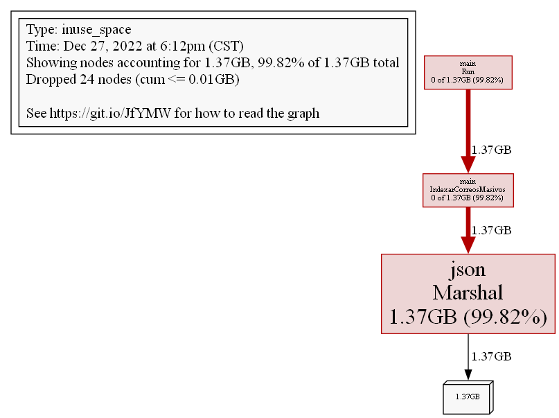

# Indexer
Challenge que indexa correos electronicos a Zincsearch

,--.             ,--.
|  | ,--,--,   ,-|  |  ,---.  ,--.  ,--.  ,---.  ,--.--. 
|  | |      \ ' .-. | | .-. :  \  `'  /  | .-. : |  .--'
|  | |  ||  | \ `-' | \   --.  /  /.  \  \   --. |  |
`--' `--''--'  `---'   `----' '--'  '--'  `----' `--'

ZincSearch Indexer 1.0
Powered by Elvin Nájera

Ingresa el nombre de archivo: prueba_emails
Archivos procesados: 21
Tiempo de procesamiento de correos: 8.0142352s
------------------------------------------------
Indexando correos a ZincSearch...
200 - {"message":"v2 data inserted","record_count":21}
------------------------------------------------
Tiempo de indexado de correos: 18.6845ms
------------------------------------------------
Tiempo Total: 8.0339875s

# Profiling Mejorado aplicando concurrencia 📊
## CPU - Heap 

